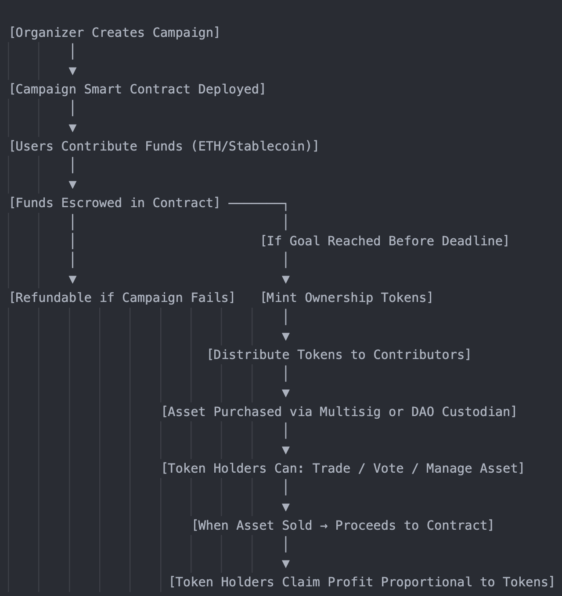

### AssetSplitX

This dApp is meant to allow users to collectively buy an expensive item, each buyer becoming a fractional owner, proportional to the 
amount of shares the user bought. 

Each object that will be sold using the protocol will be split in 100 shares and 100 tokens will be issued. Users can buy a minimum of one
share and no fractional shares can be bought. If a user owns 10 tokens he owns 10% of the item.

For each item, a campaign will start. Users can contribute with funds that will be escrowed in the contract. If the sell price is not met,
meaning the 100 shares are not entirely sold, the campaign fails and users can withdraw their funds. 

If the goal is reached before the deadline the ownership tokens will be minted and distributed to the owners(or they can redeem?).

Token holders can trade their tokens, they can vote for actions like selling the item. Upon selling, the amount obtained will be escrowed and owners will claim funds proportional to the tokens. A fraction of the profit is charged by the protocol as a fee.

